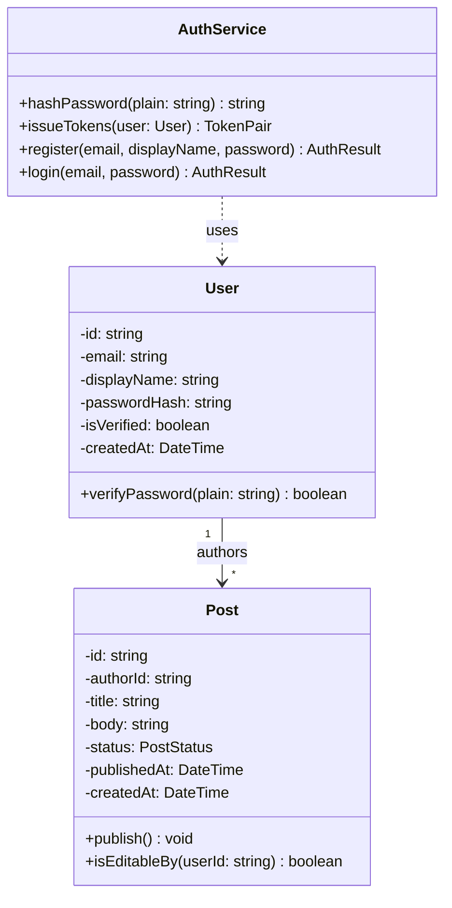

# Inkwell Design Classes v1

These are the design classes for US-01 (Register Account), US-02 (Log In) and US-04
(Browse Feed). US-03 isn't in here. The workshop said the editor is big enough to get its
own lecture, so I'll do that one in Lecture 6.

The analysis classes in docs/requirements/analysis-model.md just say what exists. These
ones have enough detail that I could go write the actual code from them.

## Class Diagram

## User (entity)

- id: string
- email: string (unique)
- displayName: string
- passwordHash: string
- isVerified: boolean
- createdAt: DateTime
+ verifyPassword(plain: string): boolean

## Post (entity)

- id: string
- authorId: string
- title: string
- body: string
- status: PostStatus (DRAFT | PUBLISHED)
- publishedAt: DateTime | null
- createdAt: DateTime
+ publish(): void
+ isEditableBy(userId: string): boolean

Relationship: User "1" --> "*" Post (authors)

## AuthService

AuthService isn't a real thing in the world, I made it up. It's just somewhere to put the
password stuff so it doesn't end up sitting on User.

+ hashPassword(plain: string): string
+ issueTokens(user: User): TokenPair
+ register(email, displayName, password): AuthResult
+ login(email, password): AuthResult

## Design decisions

Post.status can only be DRAFT or PUBLISHED, it's not free text. If it was free text then
somebody could save "publised" and nothing would stop them. The downside is if I want to
add ARCHIVED later I have to go change the database. I'd still rather do that than let
junk get saved, because cleaning up bad rows later is way worse.

Post has authorId right on it. A post only has one author, so I don't need a whole extra
table just to connect posts and users. I'd only need one of those if a post could have
more than one author, and it can't.

AuthService does the hashing instead of User. User is just the user's info. If I put
bcrypt inside User then User is stuck with bcrypt. This way if I switch to something else
later, AuthService is the only file I have to touch.

publishedAt is allowed to be null. A draft has never been published so there's no real
date to put in there. Null just means it hasn't happened yet. Putting a fake date in
would be worse.
