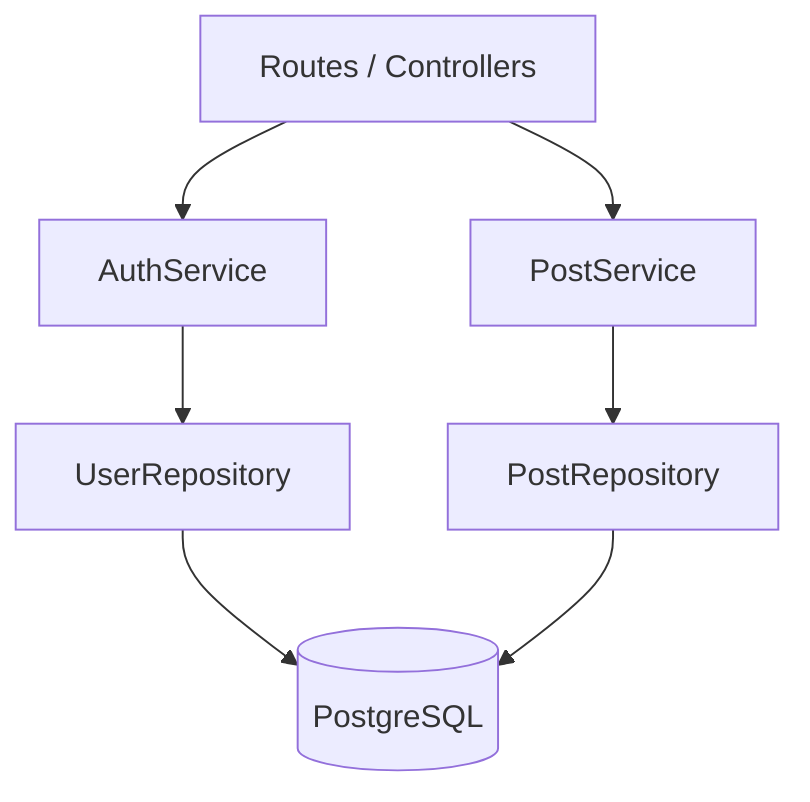

# Inkwell Server Module Structure v1

This is just who does what. I'm not writing the actual routing code until Lecture 6.

## Routes / Controllers

They take the HTTP request, call the right service, and send back the HTTP response. They
never touch Prisma or the database themselves.

## Services

AuthService does passwords and tokens.

PostService does the rules about posts. Stuff like checking that the person editing a post
is the one who wrote it, and moving a post from draft to published.

## Repositories

UserRepository and PostRepository. These two are the only ones allowed to talk to Prisma
and the database.

## Dependency flow

```
Routes -> AuthService -> UserRepository -> PostgreSQL
Routes -> PostService -> PostRepository -> PostgreSQL
```



They pass each other plain data objects. None of them reaches into another one to mess
with how it works inside.

## Why I split it like this

Each part only does one kind of thing, so when something breaks I know where to go look.
The arrows only point one way too. If I ever drop Prisma, the repositories are the only
files I'd have to fix.

I didn't split it up any more than that. Chopping AuthService into five little classes
would just be more files to keep up with and it wouldn't really help on a project this
small.
