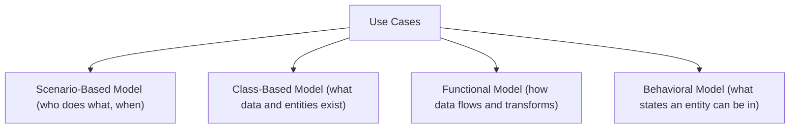
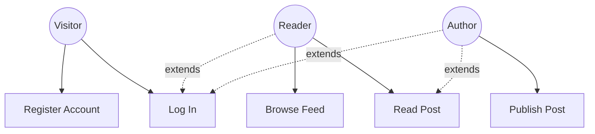
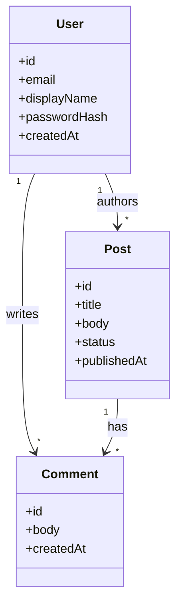
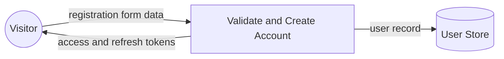
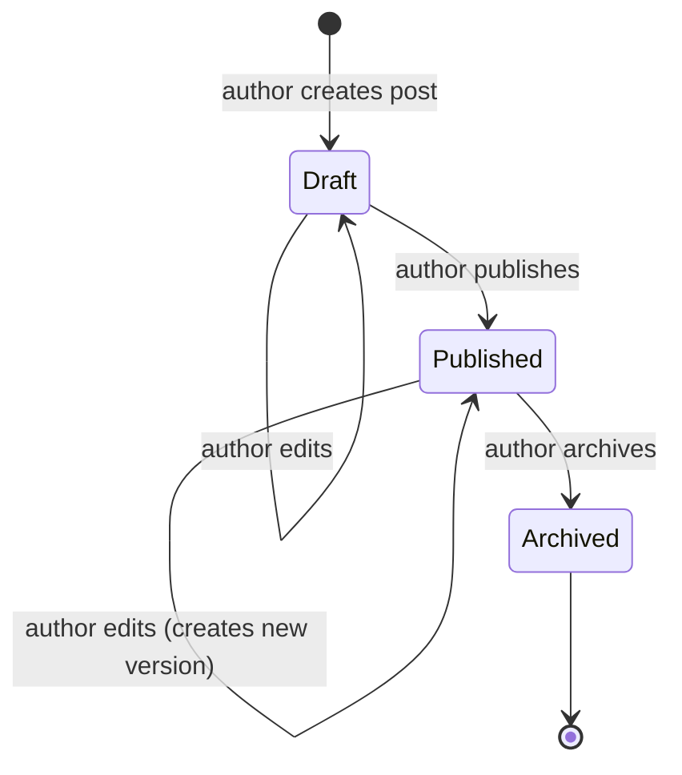

# Analysis Model

## Model Overview

---

## Scenario-Based Model

### Use Case Diagram

---

## Class-Based Model

### Domain Class Diagram

---

## Functional Model

### Registration Data Flow

---

## Behavioral Model

### Post State Diagram

